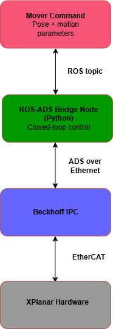

The code in this repository follows the architecture shown in the diagram below, where a Python-based ROS-ADS bridge node sends motion commands to the Beckhoff IPC over ADS and receives feedback, enabling closed-loop control of the XPlanar hardware via EtherCAT. 

This project establishes closed-loop control of Beckhoff XPlanar movers using Python by interfacing directly with the Beckhoff IPC over the ADS protocol. The ADS connection is facilitated using pyads. Our python script, mover_control.py, writes to a custom command structure GVL_Cmd.aMoverCmd defined on the Beckhoff IPC to specify target positions, velocity, and other motion paramters, while real-time mover state (position, busy/done/error flags) is continuously read back from the PLC. The core move_to function sends a position command and then polls the PLC in a loop until the move completes or an error occurs. This enables closed-loop control at the application level. 

The smart_move_to function in mover_control.py extends basic position control by adding navigation between movers. It first reads the current positions of all movers and treats the others as dynamic obstacles using a conservative AABB-based clearance model that matches TwinCAT's internal collision checks. If a direct path to the goal is not safe, it runs an A* search on a discretized workspace grid to generate a collision-free path, then simplifies this into a minimal set of axis-aligned waypoints (i.e. staircasing). Each segment is executed sequentially using the existing move_to closed-loop routine. This ensures safe, stepwise motion while continuously relying on PLC feedback for execution validation.  